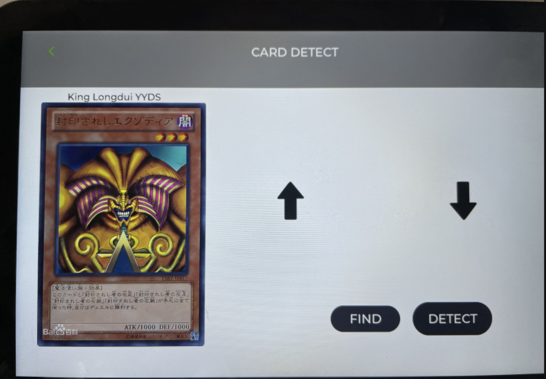
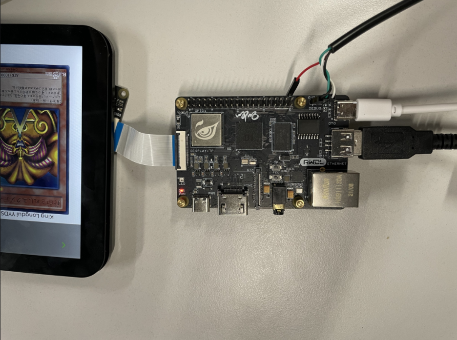

# Collector 收集者
- Card_detect and show animation  在全志D1上玩卡牌识别播放动画
   
   项目来源于Kirin。其项目创意及初衷见帖下方评论：https://bbs.aw-ol.com/topic/223/

   具体实现过程也在帖子中😁😁😁


# 名字由来
   卡牌识别游戏机历史起源不做探究，由于其识别加栈实的效果，所以为它起名为Collertor收集者。并非英雄联盟中的收集者，具有着斩杀效果，而是漫威中的收集者，其拥有者长生不老与遇见未来的能力，我们的卡牌也寓意着这样的意义。


# 硬件准备
- 哪吒开发板一块
- MIPI屏幕一块
- USB摄像头一块
- 32G SD卡一张

连接如图：


# 构建
## 1、首先安装ncnn

参考：https://github.com/Tencent/ncnn/wiki/how-to-build#build-for-allwinner-d1

## 2、源码下载
确认ncnn安装目录。更改`ncnn_card_detect\CMakeLists.txt` **20**行 `ncnn_DIR` 变量为ncnn安装目录。

```shell
git clone https://github.com/jie2311260561/Collector.git
# 服务端编译
cd ncnn_card_detect
mkdir build && cd build
cmake -DCMAKE_TOOLCHAIN_FILE=../c906.toolchain.cmake ..
build -j4
# 客户端编译
cd LVGL_APP/imx6ull-lvgl-master
make -j4
```

服务端生成文件为： `build/carddetect`  
客户端生成文件为： `LVGL_APP\imx6ull-lvgl-master\output\card22222`


# 运行
## 1、拷贝模型文件至小机端SD卡

```

```

# 源码目录

``` Shell
├─device_test_demo 
│  ├─Camer_test  
│  └─Key_test  
├─LVGL_APP  
├─ncnn_card_detect  
├─ncnn_module  
├─script  
├─yolov5_module  
└─yolov5_script  
```


